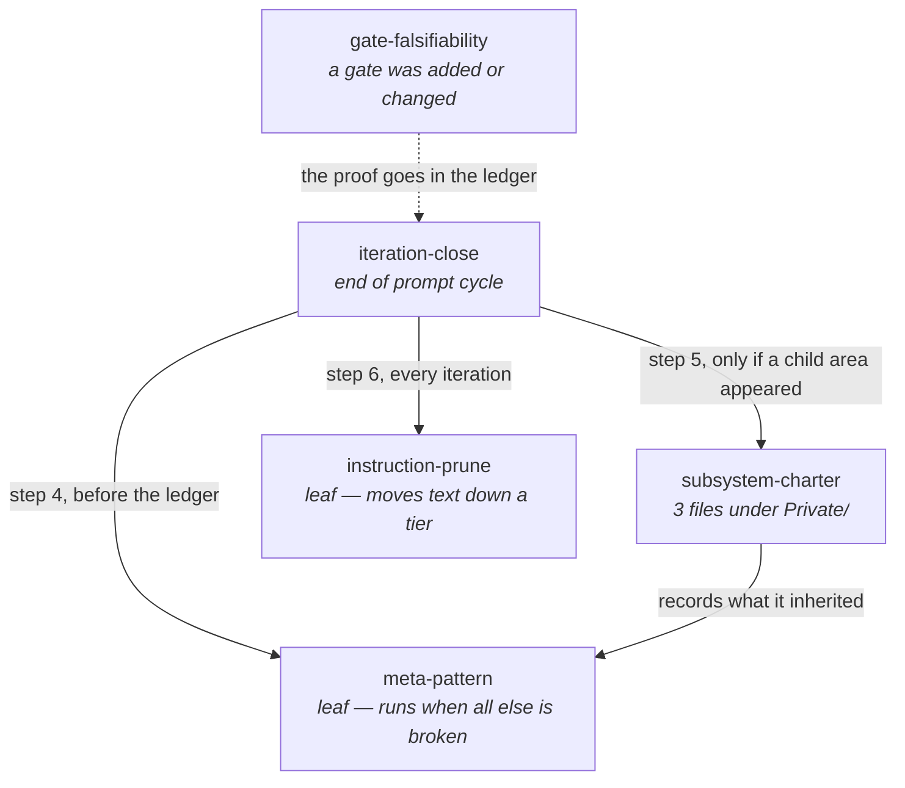

# Skills

Five skills, holding what used to live as prose in `CLAUDE.md` or as nothing at
all. Each one exists because its absence produced a specific, recent failure.

A skill's body loads only when it is invoked, which is why a procedure belongs
here and a fact belongs in `CLAUDE.md`. The split is deliberate: **the skill
holds the ritual, `CLAUDE.md` holds the rule.** Duplicating either into the
other is the accretion `instruction-prune` exists to stop.

## The five

| Skill | Triggers on | Depends on |
| --- | --- | --- |
| [`iteration-close`](iteration-close/SKILL.md) | the end of any prompt cycle; `/iteration-close` | `meta-pattern`, `subsystem-charter`, `instruction-prune` |
| [`meta-pattern`](meta-pattern/SKILL.md) | invoked by `iteration-close`; something feeling familiar at a different scale | — |
| [`subsystem-charter`](subsystem-charter/SKILL.md) | a `Private/` directory reaching three files; any new top-level directory | `meta-pattern` |
| [`instruction-prune`](instruction-prune/SKILL.md) | invoked by `iteration-close`, every iteration; the byte budget failing | — |
| [`gate-falsifiability`](gate-falsifiability/SKILL.md) | a gate added or changed; a gate green for several iterations with nobody breaking it | — |

**`gate-falsifiability` is not in the closing ritual and must not be.** It fires
on the *work*: a gate is proved in the turn it is written, not in the turn the
tag is cut. The dotted edge says only where its output lands. Wiring it into
`iteration-close` would put every proof one turn behind the change it is about,
which is exactly the failure that made `instruction-prune` idle for four
versions.

## Why each exists

**`iteration-close` — because the ritual was unwritten and one part of it was
undocumented entirely.** Eight actions end every prompt cycle here. Seven were
prose scattered across three sections of `CLAUDE.md`; the eighth — staging and
committing with a message worth reading — was written down nowhere. A habit
nothing enforces is a habit one tired session ends, and one already did:
`git add -A` swept a stray `coverage.xml` into a commit titled `asdf`. The rules
now live in the **Commit** section of `CLAUDE.md`; the order of operations lives
in the skill.

**`meta-pattern` — because patterns were discovered and then lost.** The same
idea has been rediscovered at three different scales in this repository, and
each time it was written into whichever local comment happened to be in front of
the author: a doc-comment in `Test-KnowledgeDocument`, a rule in `NAMING.md`, a
paragraph in `CLAUDE.md`. Nothing collected them, so the next scale rediscovered
each one from scratch. The ledger records what happened to the store; nothing
recorded what the implementer understood. The two-scale bar is what keeps the
log from filling with one-off profundities.

**`subsystem-charter` — because the intent did not propagate downward.**
`docs/html-architecture.md` is the only subsystem charter and it exists because
a prompt asked for it. `Private/EditorLink/` and `Private/Knowledge/` are the
same shape — many files, a shared contract, a seam — and went two versions with
none. When the next child area appears the same thing happens: nothing, until
someone notices. `tests/Private/SubsystemCharter.Tests.ps1` turns the trigger
into a red build, so noticing is no longer required.

**`instruction-prune` — because `CLAUDE.md` only grew, and the first version of
this skill could not stop it.** 46,681 bytes at v0.3.0, monotonically
increasing, read in full before every session does anything. The v0.3.0 version
proposed *deletions* for a later iteration to apply, and idled: a counter-force
one turn behind a force that acts every turn is a formality with a good
conscience, and — the real reason — **deletion has a defender.** Every line was
written because something went wrong, so the honest answer to "may I delete
this" is almost always no. At v0.4.0 a prune became a **move down a tier**,
which loses nothing and so needs no defending, and the tier is capped by the
build. 46,681 → 18,544 bytes, nothing deleted.

**`gate-falsifiability` — because four gates were proved four times from
scratch, three of them here.** The pre-tag check, the browser harness and the
lint tasks were each broken deliberately, watched go red and restored; nothing
recorded what the break was, so each was reinvented. And the four were not the
same act. The pre-tag guard needed its *filter* broken rather than its code. The
harness needed two breaks, because a parse error kills the page and a blank
canvas does not, and only the second break measured the canvas threshold at all.
`node --check` came back green on `thisFunctionDoesNotExist()` and told us its
scope was smaller than everyone had been reading it as. The fourth, the version
gate in `PSModuleGraph`, broke nothing and supplied inputs either side of a
boundary — and passed both directions while still being unable to catch the
drift that prompted it.

## The bar this directory has to clear itself

`instruction-prune` says a skill's body loads only when it is invoked. Pointed
at this directory that becomes a question: **is any of this ever invoked?** The
honest answer, as of v0.8.1:

**None of the four original skills was invoked during the four iterations from
v0.5.0 to v0.8.0.** Their procedures were followed — every iteration closed with
a ledger entry, a prune report and a byte count — but from `CLAUDE.md` and from
memory, not by loading the skill. `instruction-prune` was invoked for the first
time in `0009`, and only because a prune was genuinely needed in the same turn.

That is not by itself an argument for deleting any of them: a procedure carried
out correctly from memory is the good case, and the skill is insurance against
the tired session. It does mean **nothing here has been read under the
conditions it was written for**, which is the same shape as a gate nobody has
broken.

**And this directory is a copy.** All five skills are byte-identical to
`PSModuleGraph`'s, with nothing keeping them in sync, and the copy carries
claims that are false here:

| The text says | Here |
| --- | --- |
| `tests/Private/SubsystemCharter.Tests.ps1` backs `subsystem-charter` | that file does not exist |
| `knowledge/NAMING.md` is an on-demand destination | `knowledge/` holds only `ledger/` |
| `docs/*-architecture.md` is where subsystem text goes | the file is `docs/render-architecture.md`, and there is one |
| a facet is added or split, in the version rule | there are no facets in this repository |

Logged, not fixed — a documentation pass that also rewrites five procedure
bodies is a commit nobody reviews properly.

## Frontmatter, and three traps in it

These follow the Claude Code skill frontmatter schema — every field is optional
and `description` is only recommended. See <https://code.claude.com/docs/en/skills>.

**`name` does not name the command.** For a personal or project skill the
command comes from the **directory**; `name` sets only the display label in
listings. Renaming a skill means renaming its directory — edit the field alone
and nothing changes, with no error to tell you so. (Plugin skills differ:
there `name` does set the last segment.)

**`when_to_use` is a hint, not a hook.** It is appended to `description` in the
skill listing, under a shared 1,536-character cap, and a model reads it and
decides. Nothing fires it. Where a rule must actually hold, back it with a test:
`instruction-prune` has `tests/Instructions.Tests.ps1`, and that is a mechanism.
`subsystem-charter` cites one that exists only in `PSModuleGraph` - see the table
above - so here it is a hint and nothing more, and so is every entry in the
trigger column.

**None of the five declares `allowed-tools`, deliberately.** A project skill's
`allowed-tools` grant applies in any session that invokes it, including in a
folder that has never been trusted, so a checked-in skill pre-approving
`Bash(git *)` is a grant to every future clone of this repository. Read the
`allowed-tools` of any skill in a repo before running Claude Code there — and
think twice before adding one here. The prompts these skills produce go through
the normal permission flow instead.
